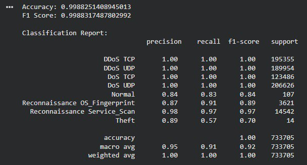
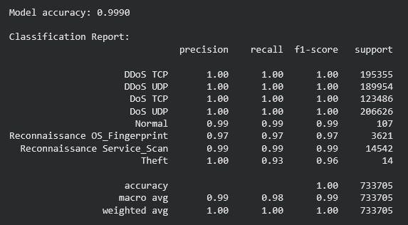
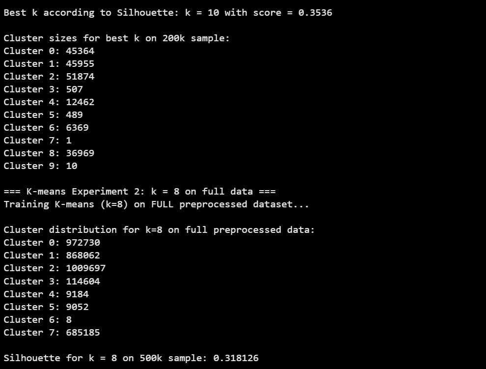
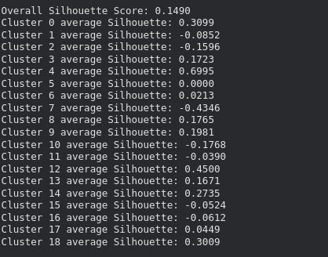
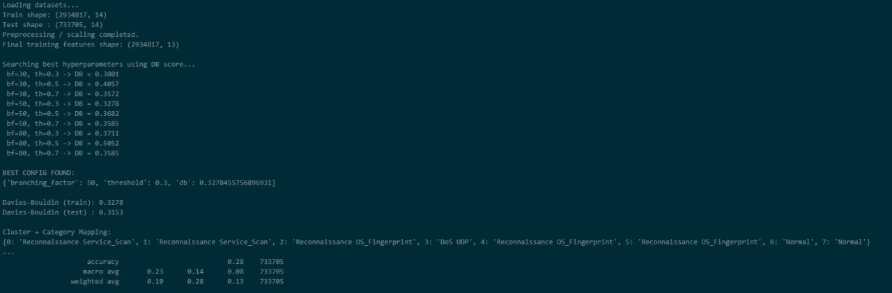

# BDS
This is the source code for a BotNet Attack detection system for the ML &amp; DM module project
you can find the models [here](https://drive.google.com/drive/folders/1KgSjJ8GBlC59LknNQmc5ok4_kdta04Al?usp=sharing), 
and the source code for the **BIRCH** model [here](https://github.com/AbdennourBELKACEM/MLmini-project-BIRCH-clustering)

The data set we used for training the different models, is somewhat big with over 3 million instances 
and 15 features, you can find the source [here](research.unsw.edu.au/projects/bot-iot-dataset).

You can find a summary report [here](https://profuse-food-75b.notion.site/Network-Intrusion-Detection-System-NIDS-using-BoT-IoT-2be2617efa3e8066b22cec218f754820?pvs=73)

# Members
- Ali Belhadj Youcef
- Belkacem Abdennour
- Guezzen Hichem
- Kerzabi Ilyes Taha
- Khaldi Anis Rabah
- Merzouka Younes Abdel Samade
- Moulay Lakhdar Zakaria

# Models tested
- KNN
- XGBoost
- Random Forest
- Gaussian Mixture Model
- KMeans
- BIRCH

# Repository Explanation
The `deploy` folder includes the code for the interface developed using **Streamlit**, that allowd you 
to input data and view the predictions of different models.

The `models` folder contains the various notebooks for making and testing the models, with 
hyper-parameter tunning.

The `eda` folder contains the notebook for Exploratory Data Analysis

The `preprocess` folder contains the notebook with different preprocessing techniques tested

# Results
## K-Nearest Neigbours

## XGBoost

## Random Forest

## K-Means

## Gaussian Mixture Model

## BIRCH

